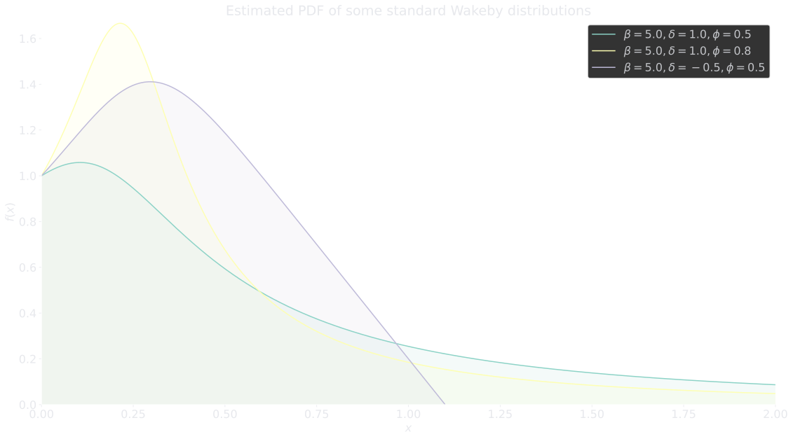
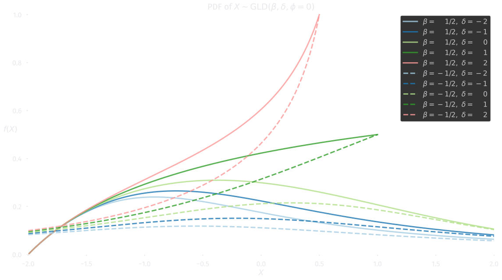

# L-moments of common probability distributions

This page lists theoretical L-moments of popular probability distributions.

All distributions are in the "standardized" form, similar to the convention
used in the `scipy.stats` distribution documentation.
Shifting a distribution only affects the L-location \( \tlmoment{s,t}{1} \),
just like the expectation and the median.
Scaling a distribution simply scales all L-moments
\( \tlmoment{s,t}{r}, \; r \ge 1 \) analogous to e.g. the
standard deviation or MAD.
Note that neither shifting nor scaling affects the L-moment ratio's
 \( \tlratio{s,t}{r} \).

Each of the listed expressions have been validated, both numerically and
symbolically (with either Wolfram Alpha, SymPy, or pen and paper).

Most of the closed-form expressions that are listed here, have been
previously reported in the literature. But for the sake of interpretability,
several have been algebraically rearranged.

Due to the exploratory use of symbolic computation software, this listing is
likely to include some novel solutions. This is also the reason for the lack
of references. But this should pose no problems in practise, since Lmo makes
it trivial to check if they aren't incorrect.

## Simple distributions

/// tip
Numerical calculation of these L-statistics using [`scipy.stats`][scipy.stats]
distributions, refer to
[`rv_continuous.l_stats`][lmo.contrib.scipy_stats.l_rv_generic.l_stats].

For direct calculation of the L-stats from a CDF or PPF, see
[`l_stats_from_cdf`][lmo.theoretical.l_stats_from_cdf] or
[`l_stats_from_ppf`][lmo.theoretical.l_stats_from_ppf], respectively.
///

An overview of the L-location, L-scale, L-skewness and L-kurtosis,
of a bunch of popular univariate probability distributions, for which they
exist (in closed form).

### L-stats

<table markdown="span">
    <tr>
        <th>Distribution</th>
        <th>Shape</th>
        <th>\( \lmoment{1} \)</th>
        <th>\( \lmoment{2} \)</th>
        <th>\( \lratio{3} = \lmoment{3}/\lmoment{2} \)</th>
        <th>\( \lratio{4} = \lmoment{4}/\lmoment{2} \)</th>
    </tr>
    <tr>
        <td>
            [Uniform](https://w.wiki/8gGh) 
            [`uniform()`][scipy.stats.uniform]
        </td>
        <td>\( [0, 1] \)</td>
        <td>\( \displaystyle \frac 1 2 \)</td>
        <td>\( \displaystyle \frac 1 6 \)</td>
        <td>\( 0 \)</td>
        <td>\( 0 \)</td>
    </tr>
    <tr>
        <td>
            [Normal](https://w.wiki/3hoJ) 
            [`norm()`][scipy.stats.norm]
        </td>
        <td></td>
        <td>\( 0 \)</td>
        <td>\( \displaystyle \frac{1}{\sqrt \pi} \\ \approx 0.5642 \)</td>
        <td>\( 0 \)</td>
        <td>
            \(
                \displaystyle 30 \
                \frac{\href{#const-theta_m}{\theta_m}}{\pi} - 9 \\
                \approx 0.1226
            \)
        </td>
    </tr>
    <tr>
        <td>
            [Logistic](https://w.wiki/8gGn) 
            [`logistic()`][scipy.stats.logistic]
        </td>
        <td></td>
        <td>\( 0 \)</td>
        <td>\( 1 \)</td>
        <td>\( 0 \)</td>
        <td>\( \displaystyle 1 / 6 \) </td>
    </tr>
    <tr>
        <td>
            [Laplace](https://w.wiki/8EYL) 
            [`laplace()`][scipy.stats.laplace]
        </td>
        <td></td>
        <td>\( 0 \)</td>
        <td>\( \displaystyle \frac 3 4 \)</td>
        <td>\( 0 \)</td>
        <td>\( \displaystyle \frac{17}{72} \\ \approx 0.2361 \)</td>
    </tr>
    <tr>
        <td>
            [Student's *t*](https://w.wiki/3r3U) 
            [`t(2)`][scipy.stats.t]
        </td>
        <td>\( \nu = 2 \)</td>
        <td>\( 0 \)</td>
        <td>\( \displaystyle \frac{\pi}{2 \sqrt 2} \\ \approx 1.1107 \)</td>
        <td>\( 0 \)</td>
        <td>\( \displaystyle \frac 3 8 \\ = 0.375 \)</td>
    </tr>
    <tr>
        <td>
            [Student's *t*](https://w.wiki/3r3U) 
            [`t(3)`][scipy.stats.t]
        </td>
        <td>\( \nu = 3 \)</td>
        <td>\( 0 \)</td>
        <td>
            \(
                \displaystyle \frac{3 \sqrt 3}{\vphantom{\pi^2}2 \pi} \\
                \approx 0.8270
            \)
        </td>
        <td>\( 0 \)</td>
        <td>
            \(
                \displaystyle 1 - \frac{\vphantom{\sqrt 3}175}{24 \pi^2} \\
                \approx 0.2612
            \)
        </td>
    </tr>
    <tr>
        <td>
            [Student's *t*](https://w.wiki/3r3U) 
            [`t(4)`][scipy.stats.t]
        </td>
        <td>\( \nu = 4 \)</td>
        <td>\( 0 \)</td>
        <td>\( \displaystyle \frac{15}{64} \pi \\ \approx 0.7363 \)</td>
        <td>\( 0 \)</td>
        <td>\( \displaystyle \frac{111}{512} \\ \approx 0.2168 \)</td>
    </tr>
    <tr>
        <td>
            [Exponential](https://w.wiki/3jXu) 
            [`expon()`][scipy.stats.expon]
        </td>
        <td></td>
        <td>\( \displaystyle 1 \)</td>
        <td>\( \displaystyle \frac 1 2 \)</td>
        <td>\( \displaystyle \frac 1 3 \)</td>
        <td>\( \displaystyle \frac 1 6 \)</td>
    </tr>
    <tr>
        <td>
            [Half-normal](https://w.wiki/8gG$) 
            [`halfnorm()`][scipy.stats.halfnorm]
        </td>
        <td></td>
        <td>\( 1 \)</td>
        <td>\( \sqrt 2 - 1 \\ \approx 0.4142 \)</td>
        <td>
            \(
                \displaystyle
                7 + 4 \sqrt 2 - 12 (2 - \sqrt 2) \frac
                    {\href{#const-theta_m}{\theta_m}}
                    {\pi}
                \\
                \approx 0.1983
            \)
        </td>
        <td>\( \approx 0.09732 \)</td>
    </tr>
    <tr>
        <td colspan="2">
            [Half-logistic](https://w.wiki/8hRg) 
            [`halflogistic()`][scipy.stats.halflogistic]
        </td>
        <td>\( 2 \ln 2 \\ \approx 1.386 \)</td>
        <td>\( 1 \)</td>
        <td>
            \(
                \displaystyle
                \frac{1}{1 - \ln 2} - 3 \\
                \approx 0.2589
            \)
        </td>
        <td>
            \(
                \displaystyle
                % \frac{23 - 33 \ln 2}{3 - 3 \ln 2} \\
                \frac 1 3 \left(
                    \frac{-10}{1 - \ln 2} + 33
                \right) \\
                \approx 0.1370
            \)
        </td>
    </tr>
    <tr>
        <td>
            [Rayleigh](https://w.wiki/8gH3) 
            [`rayleigh()`][scipy.stats.rayleigh]
        </td>
        <td></td>
        <td>
            \(
                \displaystyle
                \frac 1 2 \sqrt{2 \pi}  \\
                \approx 1.253
            \)
        </td>
        <td>
            \(
                \displaystyle
                \frac {\sqrt 2 - 1}{2} \sqrt{\pi} \\
                \approx 0.3671
            \)
        </td>
        <td>
            \(
                \displaystyle
                \frac{2 + \sqrt 2}{\sqrt 3}
                - \frac{4 + \sqrt{2}}{\sqrt 2} \\
                \approx 0.1140
            \)
        </td>
        <td>
            \(
                \displaystyle
                10 \frac{2 + \sqrt 2}{\sqrt 3}
                - 3 \frac{5 + 3 \sqrt 2}{\sqrt 2} \\
                \approx 0.1054
            \)
        </td>
    </tr>
    <tr>
        <td>
            [Gumbel](https://w.wiki/8gHD) 
            [`gumbel_r()`][scipy.stats.gumbel_r]
        </td>
        <td></td>
        <td>\( \href{#const-euler}{\gamma_e} \\ \approx 0.5772 \)</td>
        <td>\( \ln{2} \\ \approx 0.6931 \)</td>
        <td>\( 2 \log_2(3) - 3 \\ \approx 0.1699 \)</td>
        <td>\( 16 - 10 \log_2(3) \\ \approx 0.1504 \)</td>
    </tr>
    <tr>
        <td>
            [\( \chi^2 \)](https://w.wiki/7ZfA) 
            [`chi2(2)`][scipy.stats.chi2]
        </td>
        <td>\( k = 2 \)</td>
        <td>\( 2 \)</td>
        <td>\( 1 \)</td>
        <td>\( \displaystyle \frac 1 3 \)</td>
        <td>\( \displaystyle \frac 1 6 \)</td>
    </tr>
    <tr>
        <td>
            [\( \chi^2 \)](https://w.wiki/7ZfA) 
            [`chi2(4)`][scipy.stats.chi2]
        </td>
        <td>\( k = 4 \)</td>
        <td>\( 4 \)</td>
        <td>\( \displaystyle \frac 3 2 \)</td>
        <td>\( \displaystyle \frac{19}{81} \\ \approx 0.2346 \)</td>
        <td>
            \(
                \displaystyle
                \frac{367}{2^5 \cdot 3^4} \\
                \approx 0.1416
            \)
        </td>
    </tr>
    <tr>
        <td>
            [\( \chi^2 \)](https://w.wiki/7ZfA) 
            [`chi2(6)`][scipy.stats.chi2]
        </td>
        <td>\( k = 6 \)</td>
        <td>\( 6 \)</td>
        <td>\( \displaystyle \frac{15}{8} \)</td>
        <td>\( \displaystyle \frac{139}{729} \\ \approx 0.2346 \)</td>
        <td>
            \(
                \displaystyle
                \frac{200\ 827}{2^{11} \cdot 3^6} \\
                \approx 0.1345
            \)
        </td>
    </tr>
</table>

### TL-stats

Symmetrically trimmed TL-stats of some symmetric distributions.

<table markdown="span">
    <tr>
        <th>Distribution</th>
        <th>Shape</th>
        <th>\( \tlmoment{1}{1} \)</th>
        <th>\( \tlmoment{1}{2} \)</th>
        <th>\( \tlratio{1}{3} \)</th>
        <th>\( \tlratio{1}{4} \)</th>
    </tr>
    <tr>
        <td>
            [Uniform](https://w.wiki/8gGh) 
            [`uniform()`][scipy.stats.uniform]
        </td>
        <td>\( [0, 1] \)</td>
        <td>\( \displaystyle \frac 1 2 \)</td>
        <td>\( \displaystyle \frac{1}{10} \)</td>
        <td>\( 0 \)</td>
        <td>\( 0 \)</td>
    </tr>
    <tr>
        <td>
            [Normal](https://w.wiki/3hoJ) 
            [`norm()`][scipy.stats.norm]
        </td>
        <td></td>
        <td>\( 0 \)</td>
        <td>
            \(
                \displaystyle
                \frac{6}{\sqrt \pi}
                \left(
                    1 - 3 \frac{\href{#const-theta_m}{\theta_m}}{\pi}
                \right) \\
                \approx 0.2970
            \)
        </td>
        <td>\( 0 \)</td>
        <td>\( \approx 0.06248 \)</td>
    </tr>
    <tr>
        <td>
            [Logistic](https://w.wiki/8gGn) 
            [`logistic()`][scipy.stats.logistic]
        </td>
        <td></td>
        <td>\( 0 \)</td>
        <td>\( \displaystyle \frac 1 2 \)</td>
        <td>\( 0 \)</td>
        <td>\( \displaystyle \frac{1}{12} \\ = 0.083\overline{3} \dots \)</td>
    </tr>
    <tr>
        <td>
            [Laplace](https://w.wiki/8EYL) 
            [`laplace()`][scipy.stats.laplace]
        </td>
        <td></td>
        <td>\( 0 \)</td>
        <td>\( \displaystyle \frac{11}{32} \\ = 0.34375 \)</td>
        <td>\( 0 \)</td>
        <td>\( \displaystyle \frac{3}{22} \\ = 0.136\overline{36} \dots \)</td>
    </tr>
    <tr>
        <td>
            [Cauchy](https://w.wiki/8gHv) 
            [`cauchy()`][scipy.stats.cauchy]
        </td>
        <td></td>
        <td>\( 0 \)</td>
        <td>
            \(
                \displaystyle
                \frac{18}{\pi^3} \ \href{#const-zeta}{\zeta}(3) \\
                \approx 0.6978
            \)
        </td>
        <td>\( 0 \)</td>
        <td>
            \(
                \displaystyle
                \frac{25}{6} - \frac{175}{4 \pi^2} \frac
                    {\href{#const-zeta}{\zeta}(5)}
                    {\href{#const-zeta}{\zeta}(3)}
                \\
                \approx 0.3428
            \)
        </td>
    </tr>
    <tr>
        <td>
            [Student's *t*](https://w.wiki/3r3U) 
            [`t(2)`][scipy.stats.t]
        </td>
        <td>\( \nu = 2 \)</td>
        <td>\( 0 \)</td>
        <td>\( \displaystyle \frac{3 \pi}{16 \sqrt 2} \\ \approx 0.4165 \)</td>
        <td>\( 0 \)</td>
        <td>\( \displaystyle \frac{5}{32} \\ = 0.15625 \)</td>
    </tr>
    <tr>
        <td>
            [Student's *t*](https://w.wiki/3r3U) 
            [`t(3)`][scipy.stats.t]
        </td>
        <td>\( \nu = 3 \)</td>
        <td>\( 0 \)</td>
        <td>
            \(
                \displaystyle
                \frac{105 \sqrt 3}{16 \pi^3} \\
                \approx 0.3666
            \)
        </td>
        <td>\( 0 \)</td>
        <td>
            \(
                \displaystyle
                \frac{25}{6} -  \frac{23 \ 023}{(24 \pi)^2} \\
                \approx 0.1168
            \)
        </td>
    </tr>
    <tr>
        <td>
            [Student's *t*](https://w.wiki/3r3U) 
            [`t(4)`][scipy.stats.t]
        </td>
        <td>\( \nu = 4 \)</td>
        <td>\( 0 \)</td>
        <td>
            \(
                \displaystyle
                \frac{3\ 609\ \pi}{32\ 768} \\
                \approx 0.3460
            \)
        </td>
        <td>\( 0 \)</td>
        <td>
            \(
                \displaystyle
                \frac{164 \ 975}{1 \ 642 \ 496} \\
                \approx 0.1004
            \)
        </td>
    </tr>
    <tr>
        <td>
            [Gumbel](https://w.wiki/8gHD) 
            [`gumbel_r()`][scipy.stats.gumbel_r]
        </td>
        <td></td>
        <td>
            \(
                \displaystyle
                \href{#const-euler}{\gamma_e} - 2 \ln 3 + 3 \ln 2 \\
                \approx 0.4594
            \)
        </td>
        <td>\( \displaystyle 6 \ln 3 - 9 \ln 2 \\ \approx 0.3533 \)</td>
        <td>
            \(
                \displaystyle
                -\frac{10}{9}
                \frac{5 - 2 \log_2(5)}{3 - 2 \log_2(3)} - \frac{20}{9} \\
                \approx 0.1065
            \)
        </td>
        <td>
            \(
                \displaystyle
                \frac{35}{6}
                \frac{7 - 3 \log_2(5)}{3 - 2 \log_2(3)} + \frac{5}{4} \\
                \approx 0.07541
            \)
        </td>
    </tr>
</table>

### LL-stats

Right-trimmed LL-stats of some simple left-bound distributions, using
**L**inear combinations of **L**ower order statistics.

<table markdown="span">
    <tr>
        <th>Distribution</th>
        <th>Shape</th>
        <th>\( \tlmoment{0, 1}{1} \)</th>
        <th>\( \tlmoment{0, 1}{2} \)</th>
        <th>\( \tlratio{0, 1}{3} \)</th>
        <th>\( \tlratio{0, 1}{4} \)</th>
    </tr>
    <tr>
        <td>
            [Exponential](https://w.wiki/3jXu) 
            [`expon()`][scipy.stats.expon]
        </td>
        <td></td>
        <td>\( \displaystyle \frac 1 2 \)</td>
        <td>\( \displaystyle \frac 1 4 \)</td>
        <td>\( \displaystyle \frac 2 9 \\ = 0.2\overline{2} \dots  \)</td>
        <td>\( \displaystyle \frac{1}{12} \\ = 0.083\overline{3} \dots  \)</td>
    </tr>
    <tr>
        <td>
            [Half-normal](https://w.wiki/8gG$) 
            [`halfnorm()`][scipy.stats.halfnorm]
        </td>
        <td></td>
        <td>\( 2 - \sqrt 2 \\ \approx 0.5858 \)</td>
        <td>
            \(
                \displaystyle
                9 \sqrt 2 \ \frac{\href{#const-theta_m}{\theta_m}}{\pi}
                - 3 \frac{1 + \sqrt 2}{2} \\
                \approx 0.2491
            \)
        </td>
        <td>\( \approx 0.1119 \)</td>
        <td>\( \approx 0.04489 \)</td>
    </tr>
    <tr>
        <td colspan="2">
            [Half-logistic](https://w.wiki/8hRg) 
            [`halflogistic()`][scipy.stats.halflogistic]
        </td>
        <td>\( 4 \ln 2 - 2 \\ \approx 0.7726 \)</td>
        <td>\( 1 \)</td>
        <td>
            \(
                \displaystyle
                \frac{4}{27} \left(
                    \frac{5}{3 - 4 \ln 2} - 21
                \right) \\
                \approx 0.1462
            \)
        </td>
        <td>
            \(
                \displaystyle
                \frac{5}{36} \left(
                    % \frac{233 - 336 \ln 2}{3 - 4 \ln 2}
                    \frac{-19}{3 - 4 \ln 2} + 84
                \right) \\
                \approx 0.06263
            \)
        </td>
    </tr>
    <tr>
        <td>
            [Rayleigh](https://w.wiki/8gH3) 
            [`rayleigh()`][scipy.stats.rayleigh]
        </td>
        <td></td>
        <td>\( \displaystyle \frac{\sqrt \pi}{2} \\ \approx 0.8862 \)</td>
        <td>
            \(
                \displaystyle
                \frac{3 - \sqrt 6}{4} \sqrt \pi \\
                \approx 0.2439
            \)
        </td>
        <td>
            \(
                \displaystyle
                \frac{10}{9} \left(
                    3 \sqrt 2 + 2 \sqrt 3 - 2 \sqrt 6
                \right) - \frac{28}{9}  \\
                \approx 0.008\ 625
            \)
        </td>
        <td>
            \(
                \displaystyle
                \frac{1}{4} \frac
                    {80 - 75 \sqrt 2 + 14 \sqrt{10}}
                    {\sqrt 6 - 3}
                + \frac{25}{3} \\
                \approx 0.06561
            \)
        </td>
    </tr>
    <tr>
        <td>
            [Gumbel](https://w.wiki/8gHD) 
            [`gumbel_r()`][scipy.stats.gumbel_r]
        </td>
        <td></td>
        <td>
            \(
                \displaystyle
                \href{#const-euler}{\gamma_e} - \ln 2 \\
                \approx -0.1159
            \)
        </td>
        <td>
            \(
                \displaystyle
                3 \ln 2 - \frac{3}{2} \ln 3 \\
                \approx 0.4315
            \)
        </td>
        <td>
            \(
                \displaystyle
                \frac{4}{9} \left(
                    \frac{5}{2 - \log_2(3)} - 12
                \right) \\
                \approx 0.02094
            \)
        </td>
        <td>
            \(
                \displaystyle
                \frac{5}{6} \left(
                    \frac{8 - 7 \log_2(5)}{2 - \hphantom{1}\log_2(3)} + 20
                \right) \\
                \approx 0.09488
            \)
        </td>
    </tr>
    <tr>
        <td>
            [\( \chi^2 \)](https://w.wiki/7ZfA) 
            [`chi2(2)`][scipy.stats.chi2]
        </td>
        <td>\( k = 2 \)</td>
        <td>\( 1 \)</td>
        <td>\( \displaystyle \frac 1 2 \)</td>
        <td>\( \displaystyle \frac 2 9 \)</td>
        <td>\( \displaystyle \frac{1}{12} \)</td>
    </tr>
    <tr>
        <td>
            [\( \chi^2 \)](https://w.wiki/7ZfA) 
            [`chi2(4)`][scipy.stats.chi2]
        </td>
        <td>\( k = 4 \)</td>
        <td>\( \displaystyle \frac 5 2 \)</td>
        <td>\( \displaystyle \frac{31}{36} \\ = 0.861\overline{1}\dots \)</td>
        <td>\( \displaystyle \frac{241}{2\ 232} \\ \approx 0.1080 \)</td>
        <td>
            \(
                \displaystyle
                \frac{282\ 127}{372 \cdot 10^4} \\
                \approx 0.07584
            \)
        </td>
    </tr>
    <tr>
        <td>
            [\( \chi^2 \)](https://w.wiki/7ZfA) 
            [`chi2(6)`][scipy.stats.chi2]
        </td>
        <td>\( k = 6 \)</td>
        <td>\( \displaystyle \frac{33}{8} \)</td>
        <td>\( \displaystyle \frac{1\ 475}{1\ 296} \\ \approx 1.138 \)</td>
        <td>
            \(
                \displaystyle
                \frac{16\ 769}{271\ 872} \\
                \approx 0.06168
            \)
        </td>
        <td>
            \(
                \displaystyle
                \frac{550\ 465\ 668\ 887}{708 \cdot 10^{10}} \\
                \approx 0.07775
            \)
        </td>
    </tr>
</table>

## General L-moments

Lmo derived a bunch of closed-form solutions for L-moments of several
distributions. The proofs are not published, but it isn't difficult
to validate their correctness, e.g. numerically, or symbolically with sympy or
wolfram alpha / mathematica.

### Bernoulli

Surprisingly, the L-moments of the discrete
[Bernoulli distribution](https://wikipedia.org/wiki/Bernoulli_distribution)
[^BERN], can't be expressed as easily as the distribution itself:

\[
\tlmoment{s, t}{r} =
    \frac{(-1)^r}{r}
    (1 - p)^{s + 1}
    \jacobi{r + t - 1}{s + 1}{-t - 1}{2p - 1}
    + \ffact{1}{r}
\]

Here, \( \jacobi{n}{\alpha}{\beta}{x} \) is a
[Jacobi polynomial](#def-jacobi) (although it's not orthogonal for
\( t >= 0 \), since \( \beta > -1 \) does not hold).

[^BERN]:
    [J.V. Uspensky (1937)](https://www.worldcat.org/oclc/996937) --
    Introduction to mathematical probability

### Gompertz

The [Gompertz distribution](https://wikipedia.org/wiki/Gompertz_distribution)
[^GOMP] with shape parameter \( \alpha > 0 \) and \( x \ge 0 \), has the
following CDF and PPF:

\[
\begin{align*}
    F(x) &= 1 - e^{\alpha (1 - e^x)} \\
    x(F) &= \ln\left( 1 - \frac{\ln(1-F)}{\alpha} \right)
\end{align*}
\]

The general trimmed L-moments of the Gompertz distribution are:

\[
\tlmoment{s, t}{r} =
    \frac{1}{r}
    \sum_{k = t + 1}^{r + s + t}
        (-1)^{k - t - 1}
        \binom{r + k - 2}{r + t - 1}
        \binom{r + s + t}{k}
        e^{\alpha k} \
        \Gamma_{\alpha k}(0)
\]

[^GOMP]:
    [B. Gompertz (1825)](https://doi.org/10.1098/rstl.1825.0026) -- On the
    nature of the function expressive of the law of human mortality, and on a
    new mode of determining the value of life contingencies.

### GEV

The [GEV](https://wikipedia.org/wiki/GEV_distribution) unifies the
[Gumbel](https://wikipedia.org/wiki/Gumbel_distribution),
[Fréchet](https://wikipedia.org/wiki/Fr%C3%A9chet_distribution),
and [Weibull](https://wikipedia.org/wiki/Weibull_distribution) distributions.
It has one shape parameter \( \alpha \in \mathbb{R} \), and the following
distribution functions:

\[
\begin{align*}
    F(x) &= e^{-\qexp{1 - \alpha}{-x}} \\
    x(F) &= -\qlog{1 - \alpha}{-\ln(F)}
\end{align*}
\]

Here, \( \qexp{q}{y} \) and \( \qlog{q}{y} \) are the
[Tsallis](https://wikipedia.org/wiki/Tsallis_statistics)
[\( q \)-exponential](#def-qexp) and the [\( q \)-logarithm](#def-qlog),
respectively.

An alternative parametrization is sometimes used, e.g. on
[Wikipedia](https://wikipedia.org/wiki/GEV_distribution),
where \( \xi = -\alpha \).
The convention that is used here, is the same as in
[`scipy.stats.genextreme`][scipy.stats.genextreme], where `c` corresponds to
\( \alpha \).

The trimmed L-moments of the GEV are

\[
\tlmoment{s, t}{r} =
    \frac{(-1)^{r}}{r}
    \sum_{k = s + 1}^{r + s + t}
        (-1)^{k - s}
        \binom{r + k - 2}{r + s - 1}
        \binom{r + s + t}{k}
        \left(
        \begin{cases}
            \gamma_e + \ln(k)
                & \text{if } \alpha = 0 \\
            1 / \alpha - \Gamma(\alpha) \ k^{-\alpha}
                & \text{if } \alpha \neq 0
        \end{cases}
        \right)
\]

Note that the GEV is effectively a reparametrized
\( q \)-[Gumbel](https://wikipedia.org/wiki/Gumbel_distribution)
[Tsallis distribution](https://wikipedia.org/wiki/Tsallis_distribution), with
\( q = 1 - \alpha \).

[^GEV]:
    [A.F. Jenkinson (1955)](https://doi.org/10.1002/qj.49708134804) --
    The frequency distribution of the annual maximum (or minimum) values of
    meteorological elements

### GLO

The GLO [^GLO], also known as the [shifted log-logistic distribution
](https://wikipedia.org/wiki/Shifted_log-logistic_distribution), with shape
parameter \( \alpha \in \mathbb{R} \), is characterized by the following
distribution functions:

\[
\begin{align*}
    F(x) &= \frac{1}{1 + \qexp{1 - \alpha}{x}} \\
    x(F) &= -\qlog{1 - \alpha}{\frac{1 - F}{F}}
\end{align*}
\]

For \( -1 < \alpha < 1 \), the general trimmed L-moments of the GLO are:

\[
\tlmoment{s, t}{r} = \begin{cases}
    \displaystyle
        \digamma(s + 1) - \digamma(t + 1)
    & \text{if } \alpha = 0 \wedge r = 1 \\
    \displaystyle
        \frac{(-1)^r}{r} \B(r - 1,\ s + 1)
        + \frac 1 r \B(r - 1,\ t + 1)
    & \text{if } \alpha = 0 \\
    \displaystyle
        \frac{\ffact{1}{r}}{\alpha}
        + \sum_{k = s + 1}^{r + s + t}
            (-1)^{r + s - k }
            \binom{r + k - 2}{r + s - 1}
            \binom{r + s + t}{k}
            \B(\alpha,\ k - \alpha)
    & \text{if } -1 < \alpha < 1
\end{cases}
\]

Where \( \digamma(z) \) is the [digamma function](#def-digamma).

The corresponding `scipy.stats` implementation is
[`kappa4`][scipy.stats.kappa4], with `h = -1` and `k` set to \( \alpha \);
**not** [`genlogistic`][scipy.stats.genlogistic].

Note that the GLO is effectively a reparametrized
\( q \)-[logistic](https://wikipedia.org/wiki/Logistic_distribution)
[Tsallis distribution](https://wikipedia.org/wiki/Tsallis_distribution), with
\( q = 1 - \alpha \).

[^GLO]:
    [J.R.M. Hosking (1986)
    ](https://dominoweb.draco.res.ibm.com/reports/RC12210.pdf) --
    The theory of probability weighted moments

### GPD

The [GPD](https://wikipedia.org/wiki/Generalized_Pareto_distribution) [^GPD],
with shape parameter \( \alpha \in \mathbb{R} \), has for \( x \ge 0 \) the
distribution functions:

\[
\begin{align*}
    F(x) &= 1 - \qexp{1 + \alpha}{-x} \\
    x(F) &= -\qlog{1 + \alpha}{1 - F}
\end{align*}
\]

The L-moments of the GPD exist when \( \alpha < 1 + t \), and can be
compactly expressed as

\[
\tlmoment{s,t}{r} = \begin{cases}
    \displaystyle H_{s + t + 1} - H_t
        & \text{if } \alpha = 0 \wedge r = 1 \\
    \displaystyle \frac{1}{\alpha r} \left[
        \frac
            {\B(t + 1 - \alpha,\ r - 1 + \alpha)}
            {\B(r + s + t - 1 - \alpha,\ \alpha)}
        - \ffact{1}{r}
    \right]
        & \text{otherwise,}
\end{cases}
\]

where \( H_n \) is a [harmonic number](#def-harmonic).

See [`scipy.stats.genpareto`][scipy.stats.genpareto] for an Lmo-compatible
implementation.

/// admonition | Special cases
    type: info
There are several notable special cases of the GPD:

[\( q \)-Exponential](https://wikipedia.org/wiki/Q-exponential_distribution)
:   When \( \alpha > -1 \), GPD is \( q \)-exponential with shape
    \( q = 2 - 1 / (1 + \alpha) \) and rate (inverse scale)
    \( \lambda = \alpha + 1 \).

[Exponential](https://wikipedia.org/wiki/Exponential_distribution)
:   When \( \alpha = 0 \), GPD is standard exponential.

[Uniform](https://wikipedia.org/wiki/Continuous_uniform_distribution)
:   When \( \alpha = 1 \) GPD is uniform on \( [0, 1] \).
///

/// admonition | Generalizations
    type: info

[Wakeby's distribution](#wakeby)
:   Implemented as [`lmo.distributions.wakeby`][lmo.distributions.wakeby].
    See below for details, including the general L-moments in closed-form.

[Kappa distribution](https://doi.org/10.1147/rd.383.0251)
:   Implemented in as [`scipy.stats.kappa4`][scipy.stats.kappa4].
///

[^GPD]:
    [J.R.M. Hosking & J.R. Wallis (1987)
    ](https://doi.org/10.1080/00401706.1987.10488243) -- Parameter and
    Quantile Estimation for the Generalized Pareto Distribution

### Burr III / Dagum

The *Burr III* distribution [^BURR], also known as the
[*Dagum distribution*](https://wikipedia.org/wiki/Dagum_distribution), has two
shape parameters \( \alpha \) and \( \beta \), both restricted to the
positive reals

For \( x > 0 \), the distribution functions are:

\[
\begin{align*}
    F(x) &=
        (1 + x^{-\alpha})^{-\beta} \\
    x(F) &=
        (F^{-1 / \beta} - 1)^{-1 / \alpha}
\end{align*}
\]

For \( \alpha > 1 \), the general L-moments are:

\[
\tlmoment{s,t}{r} =
    (-1)^{t - 1 / \alpha} \
    \beta \
    \frac{r + s + t}{r}
    \sum_{k = s}^{r + s + t - 1}
        (-1)^{k}
        \binom{k + r - 1}{k - s}
        \binom{r + s + t - 1}{k}
        \B(1 - 1 / \alpha, -\beta - k \beta)
\]

The Burr III distribution is implemented in
[`scipy.stats.burr`][scipy.stats.burr], where the shape parameters `c` and `d`
correspond to  \( \alpha \) and \( \beta \), respectively.
Equivalently, [`scipy.stats.mielke`][scipy.stats.mielke] can be used, by
setting `k` and `s` to \( \alpha \beta \) and \( \alpha \), respectively.

The special case where \( \beta = 1 \) is known as the
[*log-logistic*](https://wikipedia.org/wiki/Log-logistic_distribution)
distribution

### Burr XII / Pareto IV

The
[*Burr XII distribution*](https://wikipedia.org/wiki/Burr_distribution) [^BURR]
has two shape parameters \( \alpha \) and \( \beta \), both restricted to the
positive reals. It is also known as the *Singh-Maddala distribution*.
The alternative parametrization \( \alpha \mapsto 1 / \gamma \), where
\( \gamma > 0 \), is known as the (standard) type IV
[*Pareto distribution*](https://wikipedia.org/wiki/Pareto_distribution)

The distribution functions for \( x > 0 \) are defined as:

\[
\begin{align*}
    F(x) &= 1 - (1 + x^\alpha)^{-\beta} \\
    x(F) &= \bigl((1 - F)^{-1/\beta} - 1 \bigr)^{1/\alpha}
\end{align*}
\]

When \( \beta > 1 / \alpha \), the general \( r \)-th trimmed L-moment is:

\[
\tlmoment{s,t}{r} =
    \beta \
    \frac{r + s + t}{r}
    \sum_{k = t}^{r + s + t - 1}
        (-1)^k
        \binom{k + r - 1}{k - t}
        \binom{r + s + t - 1}{k}
        \B\bigl(1 + 1 / \alpha,\ \beta + k \beta - 1 / \alpha \bigr)
\]

This distribution is implemented in
[`scipy.stats.burr12`][scipy.stats.burr12], where the shape parameters `c`
and `d` correspond to  \( \alpha \) and \( \beta \), respectively.

The Burr XII and Burr III distributions are related as \( Y = 1 / X \), where
\( X \) and \( Y \) are RV's with Burr XII \( (\alpha, \beta) \)
and Burr III \( (1 / \alpha, \beta) \)
distributions (or vice-versa), respectively.

In the special case where \( \alpha = 1 \) is known as the
[*Lomax distribution*](https://wikipedia.org/wiki/Lomax_distribution). This
has been implemented as [scipy.stats.lomax][scipy.stats.lomax], where the
parameter `c` corresponds to \( \beta \).

[^BURR]:
    [I.W. Burr (1942)](https://doi.org/10.1214%2Faoms%2F1177731607) --
    Cumulative Frequency Functions

### Kumaraswamy

For [Kumaraswamy's distribution
](https://wikipedia.org/wiki/Kumaraswamy_distribution) [^KUM1] with parameters
\( \alpha \in \mathbb{R}_{>0} \) and \( \beta \in \mathbb{R}_{>0} \),
the general solution for the \( r \)th (untrimmed L-moment has been derived by
M.C. Jones in 2009 [^KUM2]. Lmo has extended these results for the general
trimmed L-moments.

The distribution functions are for \( 0 \le x \le 1 \) defined as:

\[
\begin{align*}
    F(x) &= 1 - (1 - x^\alpha)^\beta \\
    x(F) &= \bigl(1 - (1 - F)^{1/\beta} \bigr)^{1/\alpha}
\end{align*}
\]

Its general \( r \)-th trimmed L-moment are:

\[
\tlmoment{s,t}{r} =
    \frac{1}{r}
    \sum_{k = t + 1}^{r + s + t}
        (-1)^{k - 1}
        \binom{r + k - 2}{r + t - 1}
        \binom{r + s + t}{k}
        \frac{\B\bigl(1 / \alpha,\ 1 + k \beta \bigr)}{\alpha}
\]

The Kumaraswamy distribution is implemented in
[`lmo.distributions.kumaraswamy`][lmo.distributions.kumaraswamy].

[^KUM1]:
    [P. Kumaraswamy](https://doi.org/10.1016/0022-1694(80)90036-0) --
    A generalized probability density function for double-bounded random
    processes
[^KUM2]:
    [M.C. Jones (2009)](https://doi.org/10.1016/j.stamet.2008.04.001) --
    Kumaraswamy's distribution: A beta-type distribution with some
    tractability advantages

### Wakeby

The [*Wakeby distribution*](https://wikipedia.org/wiki/Wakeby_distribution)
[^WAK] is quantile-based -- the CDF and PDF are not analytically expressible for the
general case.
Without loss of generality, Lmo uses a 3-parameter "standardized"
paremetrization, with shape parameters \( \beta,\ \delta,\ \phi \).

See [`lmo.distributions.wakeby`][lmo.distributions.wakeby] for the
implementation.

Each of the following restrictions apply:

- \( \beta + \delta \ge 0 \)
- \( 0 \le \phi \le 1 \)
- if \( \beta + \delta = 0 \), then \( \phi = 1 \)
- if \( \phi = 0 \), then \( \beta = 0 \)
- if \( \phi = 1 \), then \( \delta = 0 \)

The domain of the distribution is

\[
0 \le x \le \begin{cases}
    \displaystyle \frac \phi \beta - \frac{1 - \phi}{\delta}
        & \text{if } \delta < 0 \\
    \displaystyle \frac 1 \beta
        & \text{if } \beta > 0 \wedge \phi = 1 \\
    \displaystyle \infty
        & \text{otherwise}
\end{cases}
\]

The PPF is defined to be

\[
x(F) = -\phi \qlog{1 - \beta}{1 - F} - (1 - \phi) \qlog{1 + \delta}{1 - F}
\]

or, if \( \beta \neq 0 \) and \( \delta \neq 0 \), this is equivalent to

\[
x(F) =
    \frac{\phi}{\beta} (1 - (1 - F)^\beta)
    - \frac{1 - \phi}{\delta} (1 - (1 - F)^{-\delta})
\]

/// note | Alternative parametrization
This 3-parameter Wakeby distribution is equivalent to the 5-parameter
variant that is generally used, after scaling by \( \sigma \) and shifting
by \( \xi \). The shape parameters \( \beta \) and \( \delta \) are
(intentionally) equivalent, the scale parameters are related by
\( \alpha \equiv \sigma \phi \) and \( gamma \equiv \sigma (1 - \phi) \),
and the location parameter is precisely \( \xi \).

Conversely, Lmo's "standard" Wakeby distribution can by obtained from
5-Wakeby, by shifting and scaling s.t. \( \xi = 0 \) and
\( \alpha + \gamma = 1 \). Finally, \( \phi \equiv \alpha = 1 - \gamma \)
effectively combines the two scale parameters.
///

Lmo figured out that when \( \delta < t + 1 \), all of Wakeby's (trimmed)
L-moments can be expressed as

\[
\begin{align*}
    \tlmoment{s,t}{1}
    &= \phi \left(
    \begin{cases}
        \displaystyle H_{s + t + 1} - H_t
            & \text{if } \beta = 0 \\
        \displaystyle \frac{1}{\beta} - \frac
            {\rfact{t + 1}{s + 1}}
            {\beta \ \rfact{t + 1 + \beta }{s + 1}}
            & \text{if } \beta \neq 0
    \end{cases}
    \right)
    + (1 - \phi) \left(
    \begin{cases}
        \displaystyle H_{s + t + 1} - H_t
            & \text{if } \delta = 0 \\
        \displaystyle \frac
            {\rfact{t + 1}{s + 1}}
            {\delta \rfact{t + 1 - \delta}{s + 1}}
        - \frac{1}{\delta}
            & \text{if } \delta \neq 0
    \end{cases}
    \right) \\
    \tlmoment{s,t}{r}
    &= \frac{\rfact{r + t}{s + 1}}{r} \left(
        \phi \frac
            {\rfact{1 - \beta}{r - 2}}
            { \rfact{1 + \beta + t}{r + s}}
        + (1 - \phi) \frac
            {\rfact{1 + \delta}{r - 2}}
            {\rfact{1 - \delta + t}{r + s}}
    \right) \quad \text{for } r > 1
\end{align*}
\]

where \( H_n \) is a [harmonic number](#def-harmonic).

/// admonition | Special cases
    type: info
There are several notable special cases of the Wakeby distribution:

[GPD -- Generalized Pareto](#gpd)
:   With \( \phi = 0 \), Wakeby is the standard GPD, and
    \( \delta \) its shape parameter.

    Conversely, \( \phi = 1 \) yields a *bounded* GPD variant, with
    shape parameter \( -\beta \), and \( 1 / \beta \) the upper bound.

[Exponential](https://wikipedia.org/wiki/Exponential_distribution)
:   With \( \beta = \delta = 0 \) and \( \phi = 1 \), Wakeby is
    standard exponential.

[Uniform](https://wikipedia.org/wiki/Continuous_uniform_distribution)
:   With \( \beta = \phi = 1 \) (and therefore \( \delta = 0 \)) Wakeby
    is uniform on \( [0, 1] \).
///

[^WAK]:
    [J.C. Houghton (1978)](https://doi.org/10.1029/WR014i006p01105) -- Birth
    of a parent: The Wakeby Distribution for modeling flood flows

### GLD

The GLD [^GLD] is a flexible generalization of the [Tukey lambda distribution
](https://wikipedia.org/wiki/Tukey_lambda_distribution).
Lmo uses an unconventional "standardized"
paremetrization, with shape parameters \( \beta,\ \delta,\ \phi \), where
\( \phi \in [-1, 1] \) replaces the more commonly used shape parameters
\( \alpha \mapsto 1 + \phi \) and \( \gamma \mapsto 1 - \phi \).

The GLD is implemented as
[`lmo.distributions.genlamda`][lmo.distributions.genlambda].

As with the Wakeby distribution, the PDF and CDF of the GLD are not
analytically expressible. Instead, the GLD is defined through its PPF:

\[
x(F) = (\phi + 1) \qlog{1 - \beta}{F} + (\phi - 1) \qlog{1 - \delta}{1 - F}
\]

The domain is

\[
\left.
\begin{array}{ll}
    \text{if } \beta \le 0: & \displaystyle -\infty \\
    \text{if } \beta > 0:  & \displaystyle -\frac{1 + \phi}{\beta}
\end{array}
\right\} \le
x
\le \left\{ \begin{array}{ll}
    \displaystyle \infty \ , & \text{if } \delta \le 0 \\
    \displaystyle \frac{1 - \phi}{\delta} \ , & \text{if } \delta > 0
\end{array}
\right.
\]

Unlike GLD's central product-moments, which have no general closed-form
expression, its trimmed L-moments can be compactly expressed.
When \( \beta > -s - 1 \) and \( \delta > -t - 1 \), the L-moments are defined
for \( r = 2, 3, \ldots \) and \( s, t \ge 0 \) as

\[
r \tlmoment{s, t}{r}
    = \frac{(-1)^r \ (1 + \phi)}{r + s + t + \beta}
    \frac
        {\B(1 + s + \beta ,\ r - 1 - \beta)}
        {\B(r + s + t + \beta,\ 1 - \beta)}
    + \frac{1 - \phi}{r + s + t + \delta}
    \frac
        {\B(1 + t + \delta ,\ r - 1 - \delta)}
        {\B(r + s + t + \delta,\ 1 - \delta)} \ ,
\]

and the arbitrarily-trimmed L-location is

\[
\tlmoment{s, t}{1}
    = -(1 + \phi) \mathfrak{L}_{1}^{(s)}(\beta)
    + (1 - \phi) \mathfrak{L}_{1}^{(t)}(\delta) \,
\]

where

\[
\mathfrak{L}_{1}^{(k)}(\theta) = \begin{cases}
    \displaystyle H_{s + t + 1} - H_k
        & \text{if } \theta = 0 \\
    \displaystyle \frac{1}{\theta}\left(
        1 - \frac
            {\B(1 + k + \theta,\ 2 + s + t)}
            {\B(1 + k,\ 2 + s + t + \theta)}
    \right)
        & \text{otherwise.}
\end{cases}
\]

These equations look scarier that they actually are. To see why, take a look
at the first 4 L-moment, with 4 styles of trimming:

=== "L-moments"
    If \( \beta > -1 \) and \( \delta > -1 \):

    \[
    \begin{align*}
        \lmoment{1}
            &= -(1 + \phi) \frac
                {1}
                {1 + \beta}
            &&+ (1 - \phi) \frac
                {1}
                {1 + \delta}
        \\
        \lmoment{2}
            &= \hphantom{-}(1 + \phi) \frac
                {1}
                {(1 + \beta)(2 + \beta)}
            &&+ (1 - \phi) \frac
                {1}
                {(1 + \delta)(2 + \delta)}
        \\
        \lmoment{3}
            &= -(1 + \phi) \frac
                {1 - \beta}
                {(1 + \beta)(2 + \beta)(3 + \beta)}
            &&+ (1 - \phi) \frac
                {1 - \delta}
                {(1 + \delta)(2 + \delta)(3 + \delta)}
        \\
        \lmoment{4}
            &= \hphantom{-}(1 + \phi) \frac
                {(1 - \beta)(2 - \beta)}
                {(1 + \beta)(2 + \beta)(3 + \beta)(4 + \beta)}
            &&+ (1 - \phi) \frac
                {(1 - \delta)(2 - \delta)}
                {(1 + \delta)(2 + \delta)(3 + \delta)(4 + \delta)}
    \end{align*}
    \]
=== "LL-moments"
    If \( \beta > -1 \) and \( \delta > -2 \):

    \[
    \begin{align*}
        \tlmoment{0, 1}{1}
            &= -(1 + \phi) \frac
                {3 + \beta}
                {(1 + \beta)(2 + \beta)}
            &&+ (1 - \phi) \frac
                {1}
                {2 + \delta}
        \\
        \frac{1}{3}\tlmoment{0, 1}{2}
            &= \hphantom{-} (1 + \phi) \frac
                {1}
                {(1 + \beta)(2 + \beta)(3 + \beta)}
            &&+ \frac{1 - \phi}{2} \frac
                {1}
                {(2 + \delta)(3 + \delta)}
        \\
         \frac{1}{4} \tlmoment{0, 1}{3}
            &= -(1 + \phi) \frac
                {1 - \beta}
                {(1 + \beta)(2 + \beta)(3 + \beta)(4 + \beta)}
            &&+ \frac{1 - \phi}{3} \frac
                {(1 - \delta)}
                {(2 + \delta)(3 + \delta)(4 + \delta)}
        \\
         \frac{1}{5} \tlmoment{0, 1}{4}
            &= \hphantom{-} (1 + \phi) \frac
                {(1 - \beta)(2 - \beta)}
                {(1 + \beta)(2 + \beta)(3 + \beta)(4 + \beta)(5 + \beta)}
            &&+ \frac{1 - \phi}{4} \frac
                {(1 - \delta)(2 - \delta)}
                {(2 + \delta)(3 + \delta)(4 + \delta)(5 + \delta)}
    \end{align*}
    \]
=== "LH-moments"
    If \( \beta > -2 \) and \( \delta > -1 \):

    \[
    \begin{align*}
        \tlmoment{1, 0}{1}
            &= -(1 + \phi) \frac
                {1}
                {(2 + \beta)}
            &&+ (1 - \phi) \frac
                {3 + \beta}
                {(1 + \delta)(2 + \delta)}
        \\
        \frac{1}{3}\tlmoment{1, 0}{2}
            &= \hphantom{-} \frac{1 + \phi}{2} \frac
                {1}
                {(2 + \beta)(3 + \beta)}
            &&+ (1 - \phi) \frac
                {1}
                {(1 + \delta)(2 + \delta)(3 + \delta)}
        \\
         \frac{1}{4} \tlmoment{1, 0}{3}
            &= -\frac{1 + \phi}{3} \frac
                {1 - \beta}
                {(2 + \beta)(3 + \beta)(4 + \beta)}
            &&+ (1 - \phi) \frac
                {(1 - \delta)}
                {(1 + \delta)(2 + \delta)(3 + \delta)(4 + \delta)}
        \\
         \frac{1}{5} \tlmoment{1, 0}{4}
            &= \hphantom{-} \frac{1 + \phi}{4} \frac
                {(1 - \beta)(2 - \beta)}
                {(2 + \beta)(3 + \beta)(4 + \beta)(5 + \beta)}
            &&+ (1 - \phi) \frac
                {(1 - \delta)(2 - \delta)}
                {(1 + \delta)(2 + \delta)(3 + \delta)(4 + \delta)(5 + \delta)}
    \end{align*}
    \]
=== "TL-moments"
    If \( \beta > -2 \) and \( \delta > -2 \):

    \[
    \begin{align*}
        \tlmoment{1}{1}
            &= -(1 + \phi) \frac
                {5 + \beta}
                {(2 + \beta)(3 + \beta)}
            &&+ (1 - \phi) \frac
                {5 + \delta}
                {(2 + \delta)(3 + \delta)}
        \\
        \frac{2}{3 \cdot 4} \tlmoment{1}{2}
            &= \hphantom{-} (1 + \phi) \frac
                {1}
                {(2 + \beta)(3 + \beta)(4 + \beta)}
            &&+ (1 - \phi) \frac
                {1}
                {(2 + \delta)(3 + \delta)(4 + \delta)}
        \\
        \frac{3}{4 \cdot 5} \tlmoment{1}{3}
            &= -(1 + \phi) \frac
                {(1 - \beta)}
                {(2 + \beta)(3 + \beta)(4 + \beta)(5 + \beta)}
            &&+ (1 - \phi)  \frac
                {(1 - \delta)}
                {(2 + \delta)(3 + \delta)(4 + \delta)(5 + \delta)}
        \\
        \frac{4}{5 \cdot 6} \tlmoment{1}{4}
            &= \hphantom{-} (1 + \phi) \frac
                {(1 - \beta)(2 - \beta)}
                {(2 + \beta)(3 + \beta)(4 + \beta)(5 + \beta)(6 + \beta)}
            &&+ (1 - \phi) \frac
                {(1 - \delta)(2 - \delta)}
                {(2 + \delta)(3 + \delta)(4 + \delta)(5 + \delta)(6 + \delta)}
    \end{align*}
    \]

/// admonition | Special cases
    type: info
There are several notable special cases of the GLD:

[GPD](#gpd)
:   With \( \phi = -1 \), GLD is GPD with shape \( \alpha \equiv -\delta \)
    and scale \( \sigma = 2 \).

[Lomax](https://wikipedia.org/wiki/Lomax_distribution)
:   With \( \phi = -1 \) and \( \delta < 0 \), GLD is the Lomax distribution
    with shape \( \alpha = -1 / \delta \) and scale \( \sigma = -2 / \delta \).

[Exponential](https://wikipedia.org/wiki/Logistic_distribution)
:   With \( \beta = \delta = 0 \) and \( \phi = -1 \), GLD is
    exponential with rate \( \lambda = \frac 1 2 \), or scale \( \sigma = 2 \).

[Tukey-Lambda](https://wikipedia.org/wiki/Tukey_lambda_distribution)
:   With \( \lambda \equiv \beta = \delta \) and \( \phi = 0 \), GLD is the
    standard Tukey-lambda distribution, and \( \lambda \) its shape parameter.

[Logistic](https://wikipedia.org/wiki/Logistic_distribution)
:   With \( \beta = \delta = 0 \) and \( \phi = 0 \), GLD is
    standard logistic.

[Uniform](https://wikipedia.org/wiki/Continuous_uniform_distribution)
:   With \( \beta = \delta = 1 \), GLD is uniform on
    \( [-1 - \phi,\ 1 - \phi] \).

    With \( \beta = \delta = 2 \) and \( \phi = 0 \) GLD is uniform on
    \( \left[-\frac 1 2,\ \frac 1 2\right] \).

    With \( \delta = 1 \) and \( \phi = -1 \), GLD is uniform on
    \( [0,\ 2] \)
///

[^GLD]:
    [J.S. Ramberg & B.W. Schmeiser (1974)
    ](https://doi.org/10.1145/360827.360840) -- An approximate method for
    generating asymmetric random variables

## Constants and special functions

An overview of the (non-obvious) mathematical notation of special functions
and constants.

<table markdown="span">
    <tr>
        <th>Name</th>
        <th>Notation</th>
        <th>Definition</th>
        <th>Python</th>
    </tr>
    <tr id="const-euler">
        <td>
            [Euler–Mascheroni constant
            ](https://wikipedia.org/wiki/Euler-Mascheroni_constant)
        </td>
        <td>\( \gamma_e \)</td>
        <td>
            $$
            \begin{align\*}
                &= \lim_{x \to 0} \left( \frac 1 x - \Gamma(x) \right) \\\\
                &= \int_1^\infty
                    \left(
                        \frac{1}{\lfloor x \rfloor} - \frac 1 x
                    \right) \
                    \mathrm{d} x \\\\
                &\approx 0.5772 \vphantom{\frac 1 1}
            \end{align\*}
            $$
        </td>
        <td>[`numpy.euler_gamma`][numpy.euler_gamma]</td>
    </tr>
    <tr id="const-theta_m">
        <td>
            [Magic angle](https://wikipedia.org/wiki/Magic_angle)
        </td>
        <td>\( \theta_m \)</td>
        <td>
            $$
            \begin{align\*}
                &= \tan^{-1} \sqrt 2 = \cos^{-1} \frac{1}{\sqrt 3} \\\\
                &\approx 0.9553
            \end{align\*}
            $$
        </td>
        <td>[`lmo.constants.theta_m`][lmo.constants.theta_m]</td>
    </tr>
    <tr id="def-gammainc" class="row-double-top">
        <td>
            [Incomplete Gamma function
            ](https://wikipedia.org/wiki/Incomplete_gamma_function)
        </td>
        <td>\( \Gamma_a(z) \)</td>
        <td>
            $$
            = \int_a^\infty t^{z - 1} e^{-t} \, \mathrm{d} t
            $$
        </td>
        <td>[`lmo.special.gamma2`][lmo.special.gamma2]</td>
    </tr>
    <tr id="def-gamma">
        <td>
            [Gamma function](https://wikipedia.org/wiki/Gamma_function)
        </td>
        <td>\( \Gamma(z) \)</td>
        <td>\( = \Gamma_0(z) \)</td>
        <td>
            [`math.gamma`][math.gamma] 
            [`scipy.special.gamma`][scipy.special.gamma]
        </td>
    </tr>
    <tr id="def-digamma">
        <td>
            [Digamma function](https://wikipedia.org/wiki/Digamma_function) 
            (a.k.a. \( \psi(z) \ \), yet
            ["psi"](https://en.wikipedia.org/wiki/Psi_(Greek)) \( \neq \)
            ["digamma"](https://wikipedia.org/wiki/Digamma))
        </td>
        <td>\( \digamma(z) \)</td>
        <td>
            $$
            \begin{align\*}
            &= \frac{\mathrm{d}}{\mathrm{d}z} \ln \Gamma(z)
                = \frac{\Gamma'(z)}{\Gamma(z)} \\\\
            &= \int_0^1 \frac{1 - t^z}{1 - t} \mathrm{d} t - \gamma_e
            \end{align\*}
            $$
        </td>
        <td>[`scipy.special.digamma`][scipy.special.digamma]</td>
    </tr>
    <tr id="def-beta">
        <td>
            [Beta function](https://wikipedia.org/wiki/Beta_function)
        </td>
        <td>\( \B(x,\ y) \)</td>
        <td>
            $$
            \begin{align\*}
            &= \frac{\Gamma(x) \Gamma(y)}{\Gamma(x + y)} \\\\
            &= \int_0^1 t^{x - 1} (1 - t)^{y - 1} \ \mathrm{d} t
            \end{align\*}
            $$
        </td>
        <td>[`scipy.special.beta`][scipy.special.beta]</td>
    </tr>
    <tr id="def-zeta">
        <td>
            [Riemann zeta function
            ](https://wikipedia.org/wiki/Riemann_zeta_function)
        </td>
        <td>\( \zeta(z) \)</td>
        <td>
            $$
            = \sum_{n = 1}^{\infty} \frac{1}{n^z}
            $$
        </td>
        <td>[`scipy.special.zeta`][scipy.special.zeta]</td>
    </tr>
    <tr id="def-factorial" class="row-double-top">
        <td>
            [Factorial](https://wikipedia.org/wiki/Factorial)
        </td>
        <td>$$ n! \vphantom{\prod_{k=1}^n k} $$</td>
        <td>
            $$
            = \begin{cases}
                \displaystyle \prod_{k=1}^n k
                    & \text{if } n \in \mathbb{N} \\\\
                \displaystyle \Gamma(n - 1)
                    & \text{otherwise}
            \end{cases}
            $$
        </td>
        <td>
            [`math.factorial`][math.factorial] 
            [`scipy.special.factorial`][scipy.special.factorial]
        </td>
    </tr>
    <tr id="def-falling">
        <td>
            [Falling factorial
            ](https://wikipedia.org/wiki/Falling_and_rising_factorials) 
            (a.k.a. the *falling power*)
        </td>
        <td>\( \ffact{x}{n} \)</td>
        <td>
            $$
                = \frac{x!}{(x - n)!}
                = \frac{\Gamma(x + 1)}{\Gamma(x - n + 1)}
                = \rfact{x - n + 1}{n}
            $$
        </td>
        <td>[`lmo.special.fpow`][lmo.special.fpow]</td>
    </tr>
    <tr id="def-rising">
        <td>
            [Rising factorial
            ](https://wikipedia.org/wiki/Falling_and_rising_factorials)  
            (a.k.a. the *pochhammer symbol*)
        </td>
        <td>\( \rfact{x}{n} \)</td>
        <td>
            $$
                = \frac{\Gamma(x + n)}{\Gamma(x)}
                = \frac{(x + n - 1)!}{(x - 1)!}
                = \ffact{x + n - 1}{n}
            $$
        </td>
        <td>[`scipy.special.poch`][scipy.special.poch]</td>
    </tr>
    <tr id="def-binom">
        <td>
            [Binomial coefficient
            ](https://wikipedia.org/wiki/Binomial_coefficient)
        </td>
        <td>$$ \binom n k $$</td>
        <td>
            $$
                = \frac{n!}{k! \ (n - k)!}
                = \frac{1}{k \ \B(k,\ n - k + 1)}
            $$
        </td>
        <td>
            [`math.comb`][math.comb] 
            [`scipy.special.comb`][scipy.special.comb]
        </td>
    </tr>
    <tr id="def-harmonic">
        <td>
            [Harmonic number
            ](https://wikipedia.org/wiki/Harmonic_number)
        </td>
        <td>\( H_n \)</td>
        <td>
            $$
            = \begin{cases}
                \displaystyle \sum_{k=1}^n \frac{1}{k}
                    & \text{if } n \in \mathbb{N} \\\\
                \displaystyle \digamma(n + 1) + \gamma_e
                    & \text{otherwise}
            \end{cases}
            $$
        </td>
        <td>[`lmo.special.harmonic`][lmo.special.harmonic]</td>
    </tr>
    <tr id="def-jacobi" class="row-double-top">
        <td>
            [Jacobi polynomial](https://wikipedia.org/wiki/Jacobi_polynomials)
        </td>
        <td>\( \jacobi{n}{\alpha}{\beta}{x} \)</td>
        <td>
            $$
            = \frac{1}{2^n} \sum_{k=0}^n
                \binom{n + \alpha}{k}
                \binom{n + \beta}{n - k}
                (x + 1)^{n + k}
                (x - 1)^{n - k}
            $$
        </td>
        <td>[`scipy.special.eval_jacobi`][scipy.special.eval_jacobi]</td>
    </tr>
    <tr id="def-qexp" class="row-double-top">
        <td>
            [*q*-exponential](https://wikipedia.org/wiki/Tsallis_statistics)
        </td>
        <td>\( \qexp{1 - q}{x} \)</td>
        <td>
            $$
            = \begin{cases}
                \displaystyle e^x
                    & \text{if } q = 0 \\\\
                \displaystyle (1 + q x)^{\frac{1}{q}}
                    & \text{otherwise}
            \end{cases}
            $$
        </td>
        <td>[`scipy.special.inv_boxcox`][scipy.special.boxcox]</td>
    </tr>
    <tr id="def-qlog">
        <td>
            [*q*-logarithm](https://wikipedia.org/wiki/Tsallis_statistics) 
            (a.k.a. the
            [Box-Cox transform](https://wikipedia.org/wiki/Power_transform))
        </td>
        <td>\( \qlog{1 - q}{y} \)</td>
        <td>
            $$
            = \begin{cases}
                \displaystyle \ln y
                    & \text{if } q = 0 \\\\
                \displaystyle \frac{y^q - 1}{q}
                    & \text{otherwise}
            \end{cases}
            $$
        </td>
        <td>[`scipy.special.boxcox`][scipy.special.boxcox]</td>
    </tr>
</table>

*[STD]: Standard deviation
*[MAD]: Median absolute deviation
*[RV]: Random variable
*[PMF]: Probability mass function
*[PDF]: Probability density function
*[CDF]: Cumulative distribution function
*[PPF]: Percent point function, inverse of the CDF, a.k.a. quantile function
*[QDF]: Quantile density function, derivative of the PPF
*[GEV]: Generalized (maximum) Extreme Value distribution
*[GLO]: Generalized Logistic distribution
*[GPD]: Generalized Pareto Distribution
*[GLD]: Generalized Tukey–Lambda Distribution
